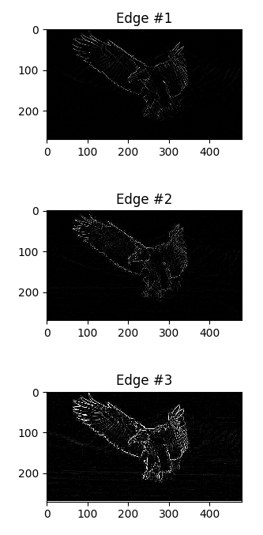
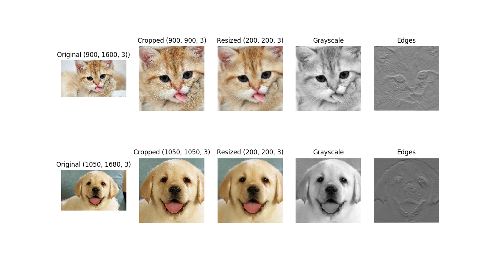

# Image processing in Python
Experimental results on Image Processing in Python.
<br/>[](https://doi.org/10.5281/zenodo.1343603)

### Courses:
* Explore course **"Convolutional Neural Networks for Image Classification"** here: https://stepik.org/course/53801/promo

### Reference to:
Valentyn N Sichkar. Image processing in Python // GitHub platform. DOI: 10.5281/zenodo.1343603

### Related works:
* Sichkar V.N. Comparison analysis of knowledge based systems for navigation of mobile robot and collision avoidance with obstacles in unknown environment. St. Petersburg State Polytechnical University Journal. Computer Science. Telecommunications and Control Systems, 2018, Vol. 11, No. 2, Pp. 64–73. DOI: <a href="https://doi.org/10.18721/JCSTCS.11206" target="_blank">10.18721/JCSTCS.11206</a> (Full-text available also here https://www.researchgate.net/profile/Valentyn_Sichkar)

* The study of Neural Networks for Computer Vision in autonomous vehicles and robotics is put in separate repository and is available here: https://github.com/sichkar-valentyn/Neural_Networks_for_Computer_Vision

* The research on Machine Learning algorithms and techniques in Python is put in separate repository and is available here: https://github.com/sichkar-valentyn/Machine_Learning_in_Python

## Description
Image processing. Getting data from images in form of matrix with numbers, slicing them into color channels, applying filtering. Code examples with a lot of comments.

## Content
Codes (it'll send you to appropriate file):
* [Opening_png_jpg.py](https://github.com/sichkar-valentyn/Image_processing_in_Python/tree/master/Codes/Opening_png_jpg.py)
* [Converting_RGB_to_GreyScale.py](https://github.com/sichkar-valentyn/Image_processing_in_Python/tree/master/Codes/Converting_RGB_to_GreyScale.py)
* [Simple_Filtering.py](https://github.com/sichkar-valentyn/Image_processing_in_Python/tree/master/Codes/Simple_Filtering.py)
* [Convolution_of_Images.py](https://github.com/sichkar-valentyn/Image_processing_in_Python/tree/master/Codes/Convolution_of_Images.py)

<br/>
Experimental results (figures and tables on this page):

* [RGB channels of the image separately](#rgb-channels-of-the-image-separately)
* [Examples of Simple Filtering for Edge Detection](#examples-of-simple-filtering-for-edge-detection)
* [Convolution of Images](#convolution-of-images)

<br/>

### <a id="rgb-channels-of-the-image-separately">RGB channels of the image separately</a>


<br/>

### <a id="examples-of-simple-filtering-for-edge-detection">Examples of Simple Filtering for Edge Detection</a>
Taking **RGB image** as input, converting it to **GrayScale**.
<br/>Consider following part of the code:

```py
# Creating an array from image data
input_image = Image.open("images/eagle.jpeg")
image_np = np.array(input_image)

# Preparing image for Edge detection
# Converting RGB image into GrayScale image
# Using formula:
# Y' = 0.299 R + 0.587 G + 0.114 B
image_GrayScale = image_np[:, :, 0] * 0.299 + image_np[:, :, 1] * 0.587 + image_np[:, :, 2] * 0.114
```

Setting **Hyperparameters** and applying **Pad frame** for input image.
<br/>Consider following part of the code:

```py
# Applying to the GrayScale image Pad frame with zero values
# Using NumPy method 'pad'
GrayScale_image_with_pad = np.pad(image_GrayScale, (1, 1), mode='constant', constant_values=0)
# Checking the shape
print(GrayScale_image_with_pad.shape)  # (272, 482)

# Preparing image for convolution
# In order to get filtered image (convolved input image) in the same size, it is needed to set Hyperparameters
# Filter (kernel) size, K_size = 3
# Step for sliding (stride), Step = 1
# Processing edges (zero valued frame around image), Pad = 1
# Consequently, output image size is (width and height are the same):
# Width_Out = (Width_In - K_size + 2*Pad)/Step + 1
# Imagine, that input image is 5x5 spatial size (width and height), then output image:
# Width_Out = (5 - 3 + 2*1)/1 + 1 = 5, and this is equal to input image
```

Declaring filters for **Edge Detection**.
<br/>Consider following part of the code:

```py
# Declaring standard filters (kernels) with size 3x3 for edge detection
filter_1 = np.array([[1, 0, -1], [0, 0, 0], [-1, 0, 1]])
filter_2 = np.array([[0, 1, 0], [1, -4, 1], [0, 1, 0]])
filter_3 = np.array([[-1, -1, -1], [-1, 8, -1], [-1, -1, -1]])
```

Creating function to **delete negative values** from resulted image, also known as **ReLU function**, by substituting them with **0**.
<br/>Consider following part of the code:

```py
# In order to prevent appearing values that are less than -1
# Following function is declared
def relu(array):
    # Preparing array for output result
    r = np.zeros_like(array)
    # Using 'np.where' setting condition that every element in 'array' has to be more than appropriate element in 'r'
    result = np.where(array > r, array, r)
    # Returning resulted array
    return result
```

Creating function to **delete values that are more than 255** by substituting them with **255**.
<br/>Consider following part of the code:

```py
# In order to prevent appearing values that are more than 255
# The following function is declared
def image_pixels(array):
    # Preparing array for output result
    # Creating an empty array
    r = np.empty(array.shape)
    # Filling array with 255 value for all elements
    r.fill(255)
    # Using 'np.where' setting condition that every element in 'array' has to be less than appropriate element in 'r'
    result = np.where(array < r, array, r)
    # Returning resulted array
    return result
```

Implementing filtering for **Edge Detection**, also known as **Convolution Operation**.
<br/>Consider following part of the code:

```py
# Implementing convolution operation for Edge detection for GrayScale image
# Going through all input image with pad frame
for i in range(GrayScale_image_with_pad.shape[0] - 2):
    for j in range(GrayScale_image_with_pad.shape[1] - 2):
        # Extracting 3x3 patch (the same size with filter) from input image with pad frame
        patch_from_input_image = GrayScale_image_with_pad[i:i+3, j:j+3]
        # Applying elementwise multiplication and summation - this is convolution operation
        # With filter_1
        output_image_1[i, j] = np.sum(patch_from_input_image * filter_1)
        # With filter_2
        output_image_2[i, j] = np.sum(patch_from_input_image * filter_2)
        # With filter_3
        output_image_3[i, j] = np.sum(patch_from_input_image * filter_3)
```

Showing resulted images on the figure.



Full code is available here: [Simple_Filtering.py](https://github.com/sichkar-valentyn/Image_processing_in_Python/tree/master/Codes/Simple_Filtering.py)

<br/>

### <a id="convolution-of-images">Convolution of Images</a>
Implementing image processing via convolution operation.
<br/>Creating function for convolution, defining filters and showing resulted images.

Reading images, cropping and resizing them.
<br/>Consider following part of the code:

```py
# Importing needed libraries
import numpy as np
import matplotlib.pyplot as plt
from scipy.misc import imread, imresize

"""
'imread' and 'imresize' will be removed from new version of 'Scipy 1.2.0'
There are other options.
For 'imread':
    from matplotlib.pyplot import imread
    from imageio import imread
"""

# Reading images
cat, dog = imread('images/cat.jpg'), imread('images/dog.jpg')

# Defining difference between width and height
print(cat.shape)  # (1080, 1920, 3)
print(dog.shape)  # (1050, 1680, 3)
difference_cat = cat.shape[1] - cat.shape[0]
difference_dog = dog.shape[1] - dog.shape[0]
# Cropping images to make it square size
# Cropping by width and taking middle part
cat_cropped = cat[:, int(difference_cat / 2):int(-difference_cat / 2), :]
dog_cropped = dog[:, int(difference_dog / 2):int(-difference_dog / 2), :]
print(cat_cropped.shape)  # (1080, 1080, 3)
print(dog_cropped.shape)  # (1050, 1050, 3)

# Defining needed image size for resizing
image_size = 200
# Defining output array for new images
# For 2 images with height = width = image_size and 3 channels
# (channels come at the end in order to show resized image)
image_resized = np.zeros((2, image_size, image_size, 3))
print(image_resized.shape)  # (2, 200, 200, 3)
# Resizing two images
image_resized[0, :, :, :] = imresize(cat_cropped, (image_size, image_size))  # (200, 200, 3)
image_resized[1, :, :, :] = imresize(dog_cropped, (image_size, image_size))  # (200, 200, 3)
```

Preparing data for convolution operation.
<br/>Consider following part of the code:

```py
# Defining output array for new image
# For 2 images with 3 channels and height = width = image_size
x = np.zeros((2, 3, image_size, image_size))
# Resizing two images
# And transposing in order to put channels first
x[0, :, :, :] = imresize(cat_cropped, (image_size, image_size)).transpose((2, 0, 1))
x[1, :, :, :] = imresize(dog_cropped, (image_size, image_size)).transpose((2, 0, 1))
print(x[0].shape)  # (3, 200, 200)
print(x[1].shape)  # (3, 200, 200) 
```

Preparing weights for convolution for 2 filters with 3 channels and size 3x3.
<br/>Consider following part of the code:

```py
# Defining array for weights
w = np.zeros((2, 3, 3, 3))

# First filter converts images into grayscale
# Defining three channels for this filter - red, green and blue
w[0, 0, :, :] = [[0, 0, 0], [0, 0.3, 0], [0, 0, 0]]
w[0, 1, :, :] = [[0, 0, 0], [0, 0.6, 0], [0, 0, 0]]
w[0, 2, :, :] = [[0, 0, 0], [0, 0.1, 0], [0, 0, 0]]

# Second filter will detect horizontal edges in the blue channel
w[1, 2, :, :] = [[1, 2, 1], [0, 0, 0], [-1, -2, -1]]

# Defining 128 biases for the edge detection filter
# in order to make output non-negative
b = np.array([0, 128])
```

Defining function for naive forward pass with convolution.
<br/>Consider following part of the code:

```py
"""
Input consists of following:
x of shape (N, C, H, W) - N data, each with C channels, height H and width W.
w of shape (F, C, HH, WW) - We convolve each input with F different filters,
where each filter spans all C channels; each filter has height HH and width WW.

'cnn_params' is a dictionary with following keys:
'stride' - step for sliding
'pad' - zero-pad frame around input

Function returns volume of feature maps of shape (N, F, H', W') where:
H' = 1 + (H + 2 * pad - HH) / stride
W' = 1 + (W + 2 * pad - WW) / stride

N here is the same as we have it as number of input images.
F here is as number of channels of each N (that are now as feature maps)

"""


def cnn_forward_naive(x, w, b, cnn_params):
    # Preparing parameters for convolution operation
    stride = cnn_params['stride']
    pad = cnn_params['pad']
    N, C, H, W = x.shape
    F, _, HH, WW = w.shape

    # Applying to the input image volume Pad frame with zero values for all channels
    # As we have in input x N as number of inputs, C as number of channels,
    # then we don't have to pad them
    # That's why we leave first two tuples with 0 - (0, 0), (0, 0)
    # And two last tuples with pad parameter - (pad, pad), (pad, pad)
    # In this way we pad only H and W of N inputs with C channels
    x_padded = np.pad(x, ((0, 0), (0, 0), (pad, pad), (pad, pad)), mode='constant', constant_values=0)

    # Defining spatial size of output image volume (feature maps) by following formulas:
    height_out = int(1 + (H + 2 * pad - HH) / stride)
    width_out = int(1 + (W + 2 * pad - WW) / stride)
    # Depth of output volume is number of filters which is F
    # And number of input images N remains the same - it is number of output image volumes now

    # Creating zero valued volume for output feature maps
    feature_maps = np.zeros((N, F, height_out, width_out))

    # Implementing convolution through N input images, each with F filters
    # Also, with respect to C channels
    # For every image
    for n in range(N):
        # For every filter
        for f in range(F):
            # Defining variable for indexing height in output feature map
            # (because our step might not be equal to 1)
            height_index = 0
            # Convolving every channel of the image with every channel of the current filter
            # Result is summed up
            # Going through all input image (2D convolution) through all channels
            for i in range(0, H, stride):
                # Defining variable for indexing width in output feature map
                # (because our step might not be equal to 1)
                width_index = 0
                for j in range(0, W, stride):
                    feature_maps[n, f, height_index, width_index] = \
                        np.sum(x_padded[n, :, i:i+HH, j:j+WW] * w[f, :, :, :]) + b[f]
                    # Increasing index for width
                    width_index += 1
                # Increasing index for height
                height_index += 1

    # Returning resulted volumes of feature maps and cash
    return feature_maps 
```

Implementing convolution of each image with each filter and offsetting by bias.
<br/>Consider following part of the code:

```py
results = cnn_forward_naive(x, w, b, {'stride': 1, 'pad': 1})
print(results.shape)  # (2, 2, 200, 200) - two images with two channels
```

Creating function for normalizing resulted images.
<br/>Consider following part of the code:

```py
def normalize_image(img):
    image_max, image_min = np.max(img), np.min(img)
    return 255 * (img - image_min) / (image_max - image_min) 
```

Preparing figures for plotting.
<br/>Consider following part of the code:

```py
figure_1, ax = plt.subplots(nrows=2, ncols=5)
# 'ax 'is as (2, 5) np array and we can call each time ax[0, 0]

# Plotting original, cropped and resized images
# By adding 'astype' we convert float numbers to integer
ax[0, 0].imshow(cat)
ax[0, 0].set_title('Original (900, 1600, 3))')
ax[0, 1].imshow(cat_cropped)
ax[0, 1].set_title('Cropped (900, 900, 3)')
ax[0, 2].imshow(image_resized[0, :, :, :].astype('int'))
ax[0, 2].set_title('Resized (200, 200, 3)')
ax[0, 3].imshow(normalize_image(results[0, 0]), cmap=plt.get_cmap('gray'))
ax[0, 3].set_title('Grayscale')
ax[0, 4].imshow(normalize_image(results[0, 1]), cmap=plt.get_cmap('gray'))
ax[0, 4].set_title('Edges')

ax[1, 0].imshow(dog)
ax[1, 0].set_title('Original (1050, 1680, 3)')
ax[1, 1].imshow(dog_cropped)
ax[1, 1].set_title('Cropped (1050, 1050, 3)')
ax[1, 2].imshow(image_resized[1, :, :, :].astype('int'))
ax[1, 2].set_title('Resized (200, 200, 3)')
ax[1, 3].imshow(normalize_image(results[1, 0]), cmap=plt.get_cmap('gray'))
ax[1, 3].set_title('Grayscale')
ax[1, 4].imshow(normalize_image(results[1, 1]), cmap=plt.get_cmap('gray'))
ax[1, 4].set_title('Edges')

# Setting axes 'off'
for i in range(2):
    for j in range(5):
        ax[i, j].set_axis_off()

# Giving the name to the window with figure
figure_1.canvas.set_window_title('Image convolution')
# Showing the plots
plt.show() 
```

Showing resulted images on the figure.



Full code is available here: [Convolution_of_Images.py](https://github.com/sichkar-valentyn/Image_processing_in_Python/tree/master/Codes/Convolution_of_Images.py)

<br/>

### MIT License
### Copyright (c) 2018 Valentyn N Sichkar
### github.com/sichkar-valentyn
### Reference to:
Valentyn N Sichkar. Image processing in Python // GitHub platform. DOI: 10.5281/zenodo.1343603
