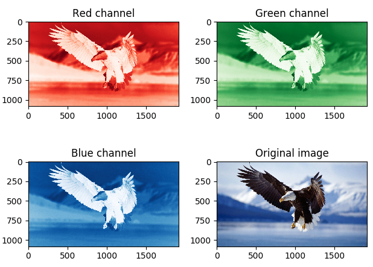

# Image processing in Python
Experimental results at image processing in Python.
<br/>[](https://doi.org/10.5281/zenodo.1343603)

### Reference to:
Valentyn N Sichkar. Image processing in Python // GitHub platform. DOI: 10.5281/zenodo.1343603

### Related works:
* Sichkar V.N. Comparison analysis of knowledge based systems for navigation of mobile robot and collision avoidance with obstacles in unknown environment. St. Petersburg State Polytechnical University Journal. Computer Science. Telecommunications and Control Systems, 2018, Vol. 11, No. 2, Pp. 64–73. DOI: <a href="https://doi.org/10.18721/JCSTCS.11206" target="_blank">10.18721/JCSTCS.11206</a>

* The study of Neural Networks for Computer Vision in autonomous vehicles and robotics is put in separate repository and is available here: https://github.com/sichkar-valentyn/Neural_Networks_for_Computer_Vision

* The research on Machine Learning algorithms and techniques in Python is put in separate repository and is available here: https://github.com/sichkar-valentyn/Machine_Learning_in_Python

## Description
Image processing. Getting data from images in form of matrix with numbers, slicing them into color channels, applying filtering. Code examples with a lot of comments.

## Content
Codes (it'll send you to appropriate file):
* [Opening_png_jpg](https://github.com/sichkar-valentyn/Image_processing_in_Python/tree/master/Codes/Opening_png_jpg.py)
* [Converting_RGB_to_GreyScale](https://github.com/sichkar-valentyn/Image_processing_in_Python/tree/master/Codes/Converting_RGB_to_GreyScale.py)
* [Symple_Filtering](https://github.com/sichkar-valentyn/Image_processing_in_Python/tree/master/Codes/Symple_Filtering.py)

<br/>
Experimental results (figures and tables on this page):

* <a href="#RGB channels of the image separately">RGB channels of the image separately</a>
* <a href="#Simple Filtering">Simple Filtering</a>

<br/>

### <a name="RGB channels of the image separately">RGB channels of the image separately</a>



<br/>

### <a name="Simple Filtering">Simple Filtering</a>

```py
import numpy as np

```


Full code is available here: [Symple_Filtering.py](https://github.com/sichkar-valentyn/Image_processing_in_Python/tree/master/Codes/Symple_Filtering.py)

<br/>

### MIT License
### Copyright (c) 2018 Valentyn N Sichkar
### github.com/sichkar-valentyn
### Reference to:
Valentyn N Sichkar. Image processing in Python // GitHub platform. DOI: 10.5281/zenodo.1343603
