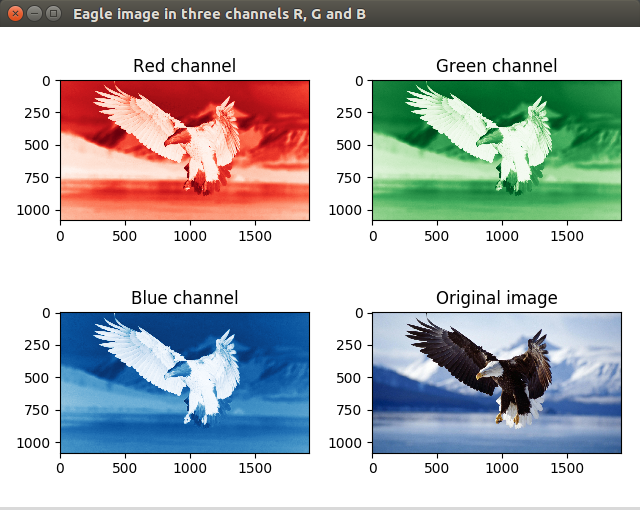

# Image processing in Python
Experimental results at image processing in Python.
 

### Reference to:
Valentyn N Sichkar. Image processing in Python // GitHub platform. DOI: 10.5281/zenodo.1343603

## Description
Image processing. Getting data from images in form of matrix with numbers, slicing them into color channels, applying filtering. Code examples with a lot of comments.

## Content
Codes (it'll send you to appropriate file):
* [Opening_png_jpg](https://github.com/sichkar-valentyn/Image_processing_in_Python/tree/master/Codes/Opening_png_jpg.py)
* [Converting_RGB_to_GreyScale](https://github.com/sichkar-valentyn/Image_processing_in_Python/tree/master/Codes/Converting_RGB_to_GreyScale.py)

 
Experimental results (figures and tables on this page):

* <a href="#RGB channels of the image separately">RGB channels of the image separately</a>

### <a name="RGB channels of the image separately">RGB channels of the image separately</a>

 

### MIT License
### Copyright (c) 2018 Valentyn N Sichkar
### github.com/sichkar-valentyn
### Reference to:
Valentyn N Sichkar. Image processing in Python // GitHub platform. DOI: 10.5281/zenodo.1343603
